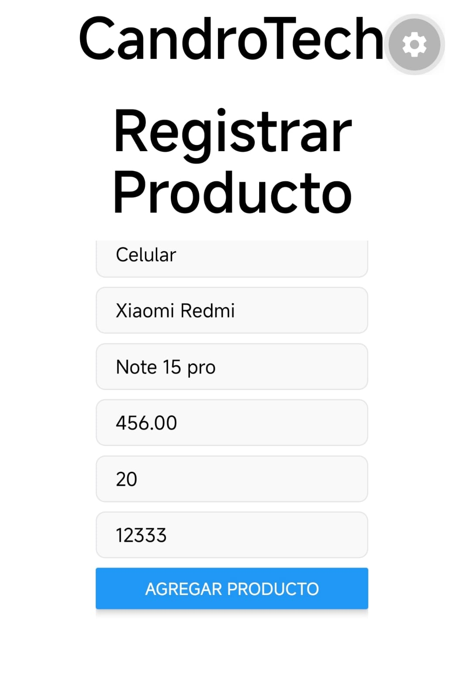
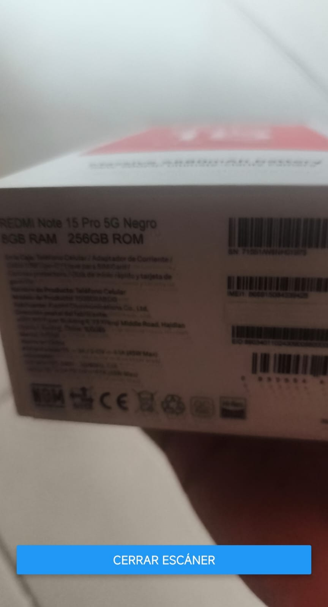
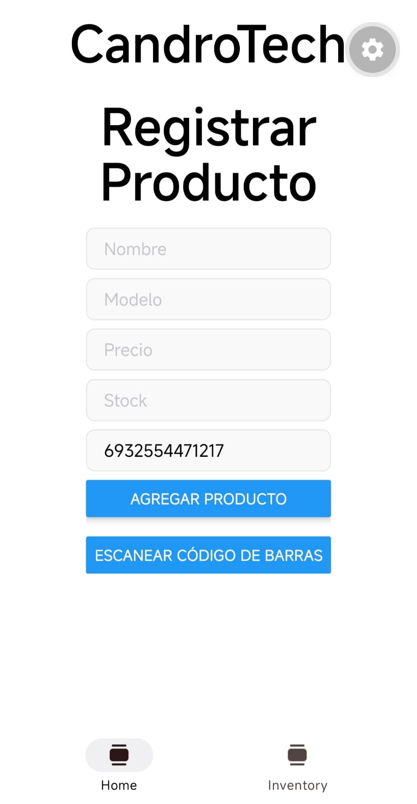
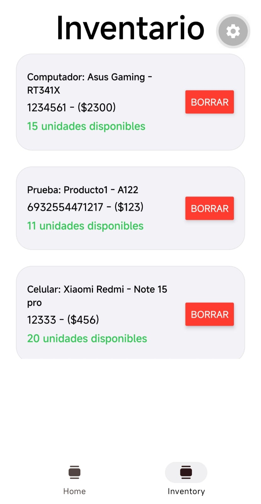

# CandroTech - App de Gestión de Inventario
**Descarga el APK:** [Instalar en tu Android](https://expo.dev/accounts/candro25/projects/app-inventario/builds/8d173339-2c7e-47f0-b348-2a356a06be5a)

## Descripción

CandroTech es una aplicación móvil diseñada para facilitar la administración y el control de inventario de productos. Desarrollada con React Native y Expo, la aplicación permite a los usuarios registrar nuevos artículos, generar o escanear códigos de barras físicos, y mantener una base de datos local persistente sin necesidad de conexión a internet.

## Capturas de Pantalla

     

## Características Principales

- **Navegación por Pestañas:** Interfaz dividida lógicamente entre la pantalla de registro (Home) y la visualización de datos (Inventario).
- **Escáner de Códigos de Barras:** Integración nativa con la cámara del dispositivo para leer formatos estándar (EAN13, EAN8, Code128, QR) y agilizar el registro.
- **Persistencia de Datos:** Uso de AsyncStorage para guardar, recuperar y eliminar productos de forma segura en la memoria del dispositivo.
- **Diseño Adaptativo:** Soporte completo e inmediato para Dark Mode y Light Mode dependiendo de la configuración del sistema operativo del usuario.
- **Validación Robusta:** Sistema anti-crashes que filtra datos corruptos y previene la creación de registros incompletos.

## Tecnologías Utilizadas

- React Native
- Expo (Expo Router para navegación)
- TypeScript
- Expo Camera
- React Native Async Storage

## Decisiones Técnicas

- **AsyncStorage en vez de SQLite:** para un MVP de gestión de inventario no era necesaria una base de datos relacional completa. AsyncStorage ofrece persistencia simple sin overhead de configuración, lo cual permitió priorizar tiempo en la lógica del escáner y la validación de datos. Si el proyecto creciera a manejar relaciones entre datos (por ejemplo, categorías con múltiples productos, o reportes históricos), sería el momento natural de migrar a SQLite.
- **Navegación por pestañas (Home / Inventario) en vez de una sola pantalla:** separar el flujo de "agregar producto" del flujo de "ver inventario" mantiene cada pantalla enfocada en una sola responsabilidad, evita formularios y listas compitiendo por espacio en la misma vista, y refleja cómo funcionan la mayoría de apps de gestión reales.
- **Expo Router (file-based routing):** en vez de configurar manualmente una librería de navegación, se aprovechó el sistema de rutas basado en archivos de Expo, donde la estructura de carpetas en `src/app/` define automáticamente la navegación — menos código de configuración, más claridad sobre qué pantalla corresponde a qué archivo.
- **Validación anti-crashes:** se filtran datos corruptos o incompletos antes de guardarlos en AsyncStorage, para evitar que un registro mal formado rompa la lectura del inventario completo al recargar la app.

## Qué Aprendí Construyendo Esta App

- A trabajar con las APIs nativas del dispositivo (cámara) a través de Expo, incluyendo el manejo de permisos.
- Cómo funciona la persistencia local en React Native con AsyncStorage: guardar, leer y eliminar datos estructurados como JSON.
- El sistema de navegación por archivos de Expo Router, y cómo estructurar una app en pestañas sin escribir configuración manual de navegación.
- A diseñar validaciones que prevengan estados inconsistentes de datos antes de que lleguen a romper la interfaz.

## Qué Mejoraría Con Más Tiempo

- Migrar a SQLite si el proyecto necesitara relaciones más complejas entre datos (categorías, proveedores, historial de movimientos).
- Agregar sincronización en la nube (Firebase o un backend propio) para no depender solo del almacenamiento local del dispositivo.
- Añadir pruebas automatizadas (Jest + React Native Testing Library) para las funciones de validación y persistencia.
- Implementar edición de productos ya registrados, no solo alta y eliminación.
- Generar un APK descargable vía EAS Build para que la app se pueda instalar sin necesidad de correr el código.

## Instalación y Ejecución Local

1. Clona este repositorio:
```
git clone https://github.com/Candro25/candrotech-inventory.git
```

2. Instala las dependencias:
```
npm install
```

3. Inicia el servidor de desarrollo de Expo:
```
npx expo start
```

4. Escanea el código QR con la aplicación Expo Go en tu dispositivo móvil (Android/iOS) para probar la aplicación.
